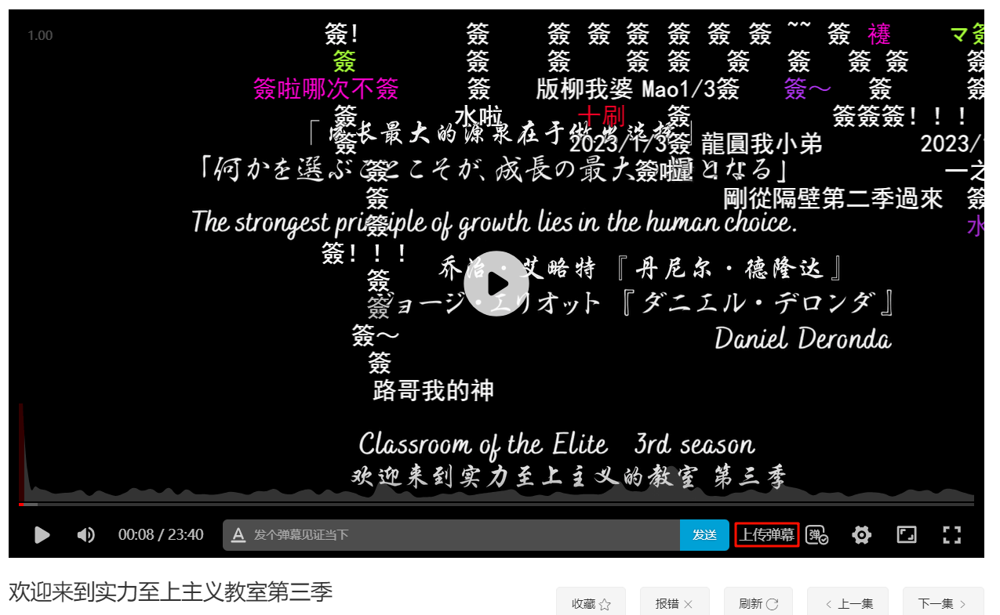
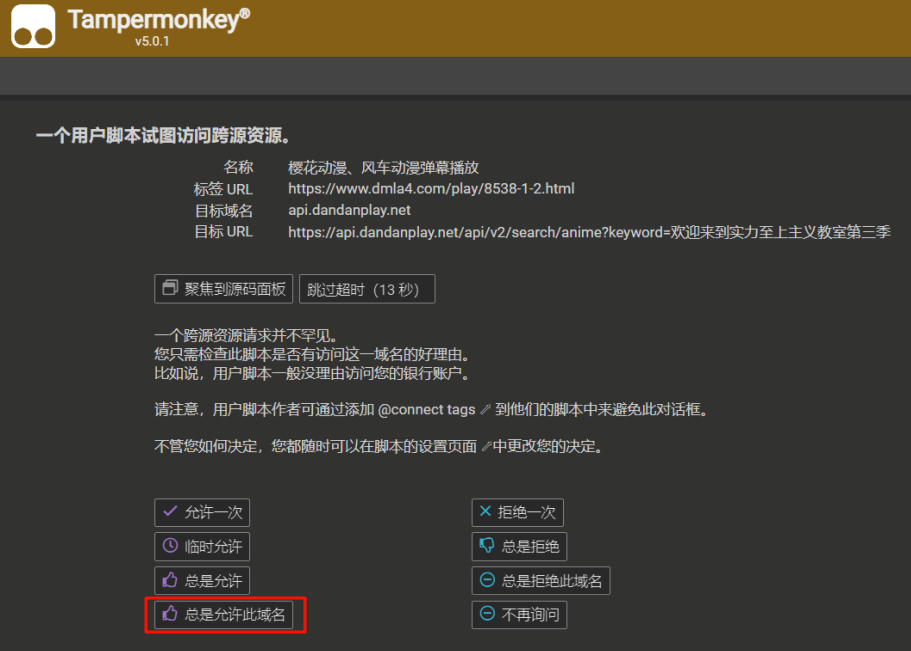

# 樱花动漫、风车动漫弹幕播放

自动匹配加载动漫剧集对应弹幕并播放，目前支持樱花动漫、风车动漫

### 支持网站

[樱花动漫、风车动漫](https://www.dmla4.com/)

### 主要功能

- 自动加载匹配的在线弹幕
- 手动搜索番剧名称，如果自动搜索没有加载弹幕时的备选方案
- 可手动上传 xml 格式本地弹幕

### 主要原理

根据页面获取动漫名称，
通过 url 确定播放剧集，
重新渲染播放器，

### 效果展示

点击上传弹幕可添加 xml 格式本地弹幕

### 手动搜索

比如[哭泣少女乐队](https://www.dmla5.com/play/8703-1-7.html)不能自动加载弹幕，在视频任意位置右键，打开菜单，将搜索番剧名称改为 Girls band cry 后，按下回车键，会重新加载当前集数的弹幕

### 安装提示

出现如下界面，请点击总是允许此域名，
该操作获取弹幕相关数据

### 油猴脚本地址
https://greasyfork.org/zh-CN/scripts/485364

